# Grocery Store Management System

**Location:** Tamil Nadu, India  
**Email:** [official.ms.baskaran@gmail.com](mailto:official.ms.baskaran@gmail.com)

---

## 🔗 Project Links

- 🚀 **Live Demo**: [Click here to view](https://online-store-ms.vercel.app/)
- 💻 **Frontend Repository**: [GitHub - Frontend](https://github.com/BaskaranMS/online_store_demo_frontend)
- 🛠️ **Backend Repository**: [GitHub - Backend](https://github.com/BaskaranMS/online_store_demo_backend)

---

## 🔐 Demo Login Credentials

> Use the following credentials to log in and explore the platform.

### 👑 Admin Login

- **Username:** admin
- **Password:** adminadmin123

### 🧑‍🏫 User Login

- **Username:** baskaran
- **Password:** 9342570232

### 🧑‍🎓 Stores Incharge Login

- **Username:** 2003
- **Password:** 9342570232

---

## 📢 Overview

The **Grocery Store Management System** is a feature-rich web application developed using the **MERN Stack** (MongoDB, Express, React, Node.js). It is designed to provide a seamless experience for both customers and administrators. Customers can browse and purchase grocery products, while store managers and admins can efficiently manage products, pricing, inventory, and orders. The system also integrates **Nodemailer** to send automated **email notifications** to both customers and admins, improving communication and workflow.

This solution is ideal for growing grocery stores looking for an integrated system to streamline daily operations, track orders, and manage inventory efficiently.

---

## 🛠 Key Features

### **For Customers (People)**

- **Signup & Login**  
  ✨ Customers can **sign up** and **log in** to their accounts securely with **JWT-based authentication**.

- **Browse Products**  
  🛒 Customers can view the complete catalog of available grocery items, categorized by type, availability, and more.

- **Add/Remove Items from Cart**  
  ➕➖ Add items to your cart with ease and **remove** unwanted products before checkout.

- **Place Orders**  
  📦 Once satisfied with the cart, customers can place orders with a smooth checkout process and receive **order confirmation emails**.

- **Request New Products**  
  📝 Customers can **suggest new products** to be added to the store, enhancing user engagement and allowing stores to adapt to customer needs.

- **Order Notifications**  
  📧 Upon placing an order, customers receive an **automated email** confirming their purchase and providing order details.

---

### **For Admins / Store Managers**

- **User Management**  
  👤 Admins and store managers can view **all users** and their order history, as well as **delete users** when necessary.

- **Product Management**  
  📑 Admins and managers have full control to **add**, **edit**, and **delete products** in the store’s inventory, ensuring the product catalog is always up-to-date.

- **Dynamic Pricing**  
  💲 Prices can be **dynamically updated**, allowing for quick adjustments across products or specific orders as market conditions change.

- **Inventory Management**  
  📦 The system automatically updates the stock levels when an order is marked as **delivered**, reducing human error in inventory tracking.

- **Order Status Updates**  
  ✅ Admins can **mark orders** as **delivered** and **payment received**, ensuring customers are always informed about the status of their orders.

- **Order Categorization by Month/Date Range**  
  📅 Orders are categorized by **month** for easy tracking, and custom **date ranges** can be used for detailed analysis.

- **Aggregate Order Summary**  
  📊 An aggregate page offers insights on **quantities** ordered by each product within a **specified month** or **date range**.

- **Downloadable Reports**  
  📥 Admins and managers can download **order and aggregate reports** in **PDF, Word**, or **Excel** formats, facilitating business analysis and decision-making.

- **Email Notifications for Admins**  
  📧 Admins receive **email alerts** every time a customer places an order, ensuring they stay informed about store activity.

---

## 💻 Technology Stack

- **Frontend**:

  - 🖥️ **React.js**
  - 💅 **Bootstrap**
  - ⚡ **Font Awesome** icons

- **Backend**:

  - 🚀 **Node.js**
  - 🛠️ **Express.js**

- **Database**:

  - 🗃️ **MongoDB**

- **Authentication**:

  - 🔑 **JWT** (JSON Web Tokens)

- **Email Notifications**:
  - 📧 **Nodemailer**

---

## 📈 Business Benefits

- **Enhanced User Experience**  
  🛍️ The intuitive interface allows customers to shop seamlessly, from browsing to checkout, providing a positive shopping experience.

- **Efficient Inventory Management**  
  📉 The system automatically updates stock levels as orders are processed, reducing manual work and ensuring accurate inventory data.

- **Data-Driven Decisions**  
  📊 Aggregated reports and order analysis help store managers make informed decisions about pricing, stock, and marketing strategies.

- **Scalability**  
  🌱 Designed to scale as the business grows, the system can accommodate a larger user base and a growing catalog of products.

- **Seamless Communication**  
  📩 Automated email notifications ensure both customers and admins are kept up-to-date on order statuses and other relevant activities.

---

## 📍 Conclusion

The **Grocery Store Management System** is an all-in-one solution that combines ease of use with powerful backend functionalities. With features such as **dynamic product pricing**, **real-time inventory updates**, and detailed **order aggregation reports**, this system helps store managers optimize operations and drive better business outcomes. For customers, it offers a smooth and reliable shopping experience, with features that keep them engaged and informed.

This system is ideal for grocery stores seeking to improve their day-to-day operations, increase sales, and provide excellent customer service.

For more details, contact me via email: [official.ms.baskaran@gmail.com](mailto:official.ms.baskaran@gmail.com).

---

## 💻 SCREENSHOTS

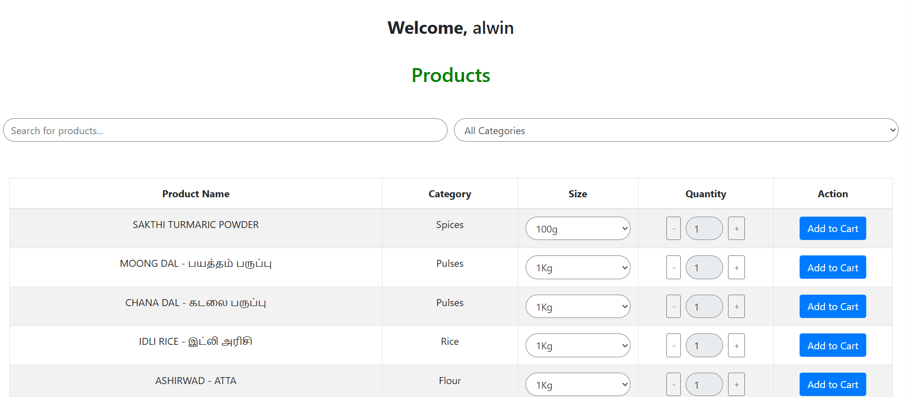
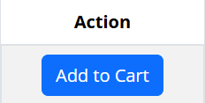
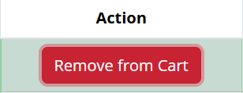
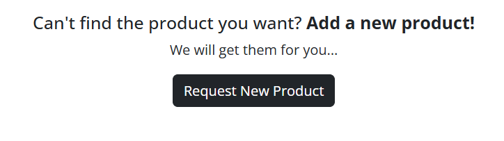

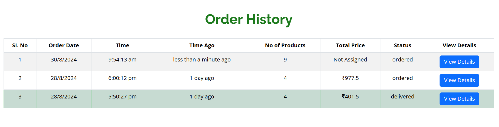
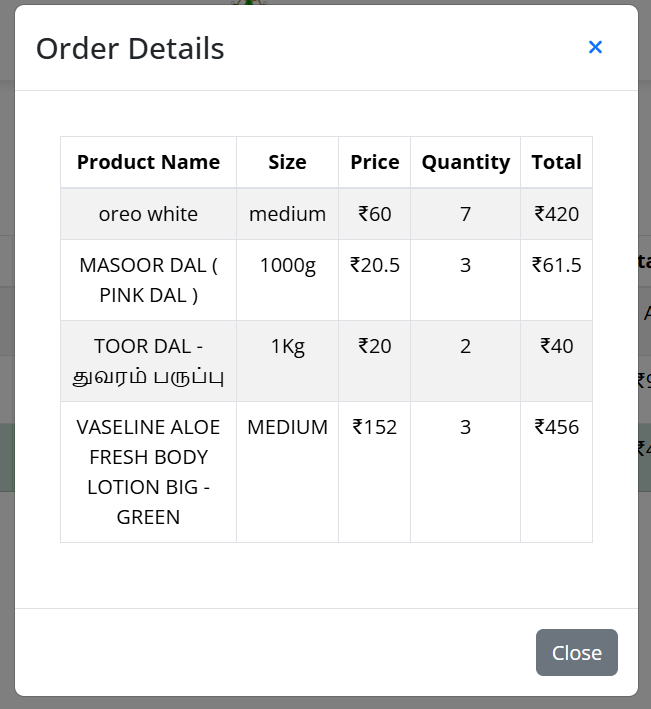

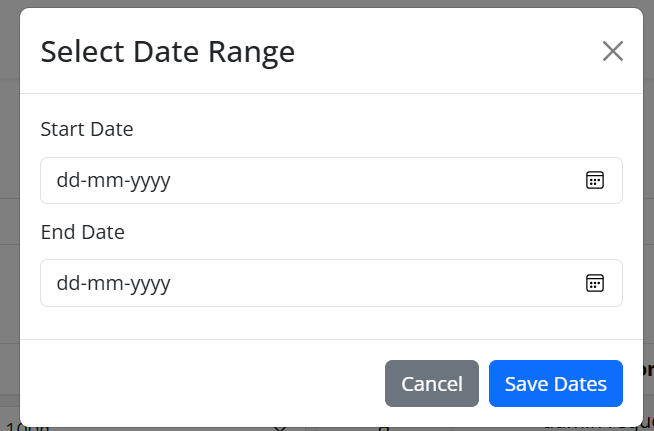

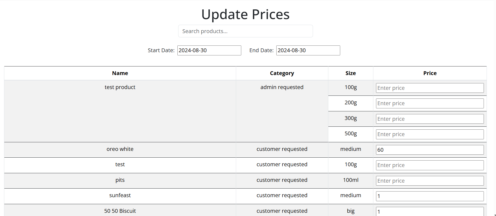
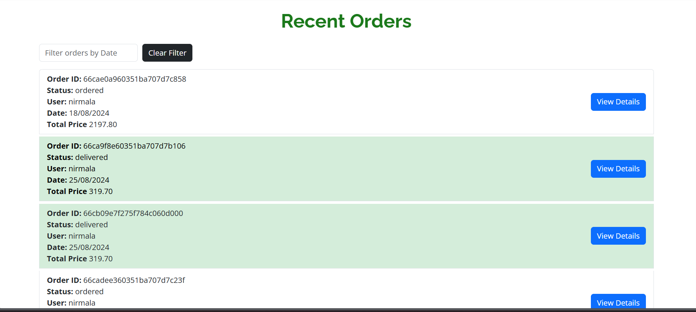

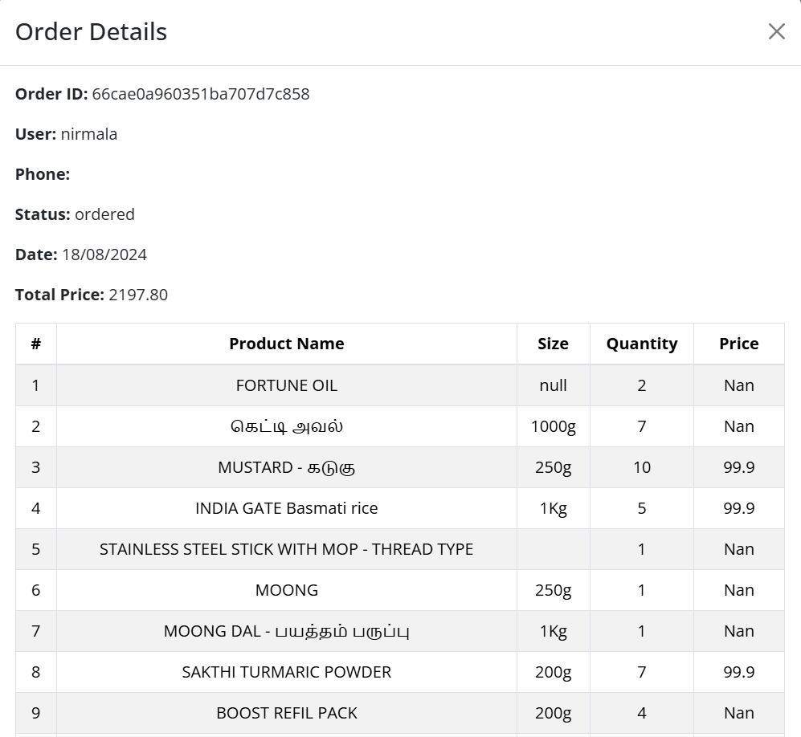

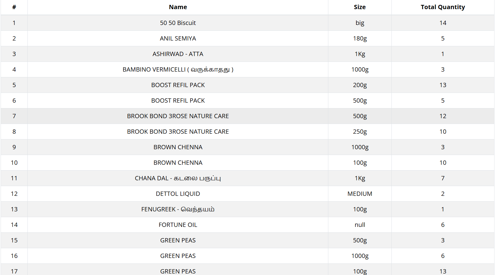

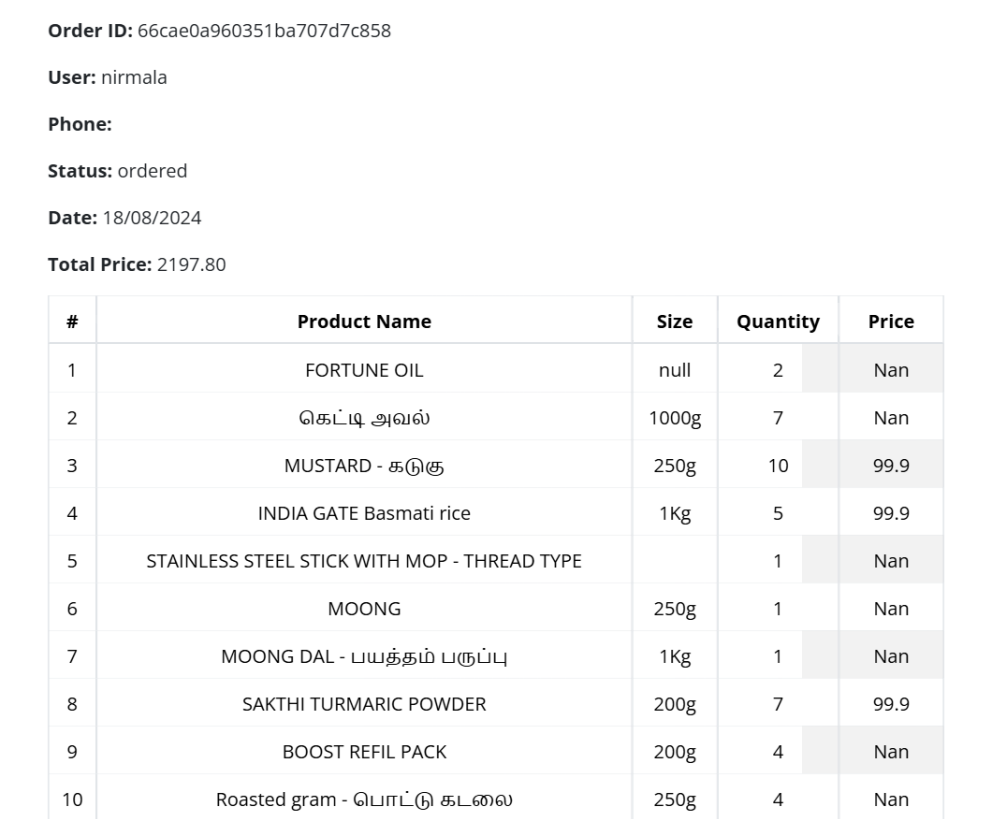
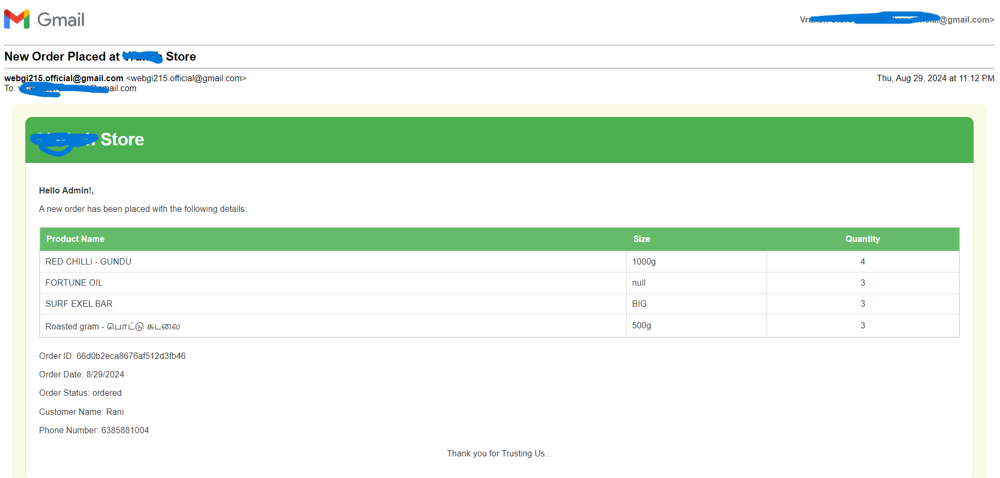

---
